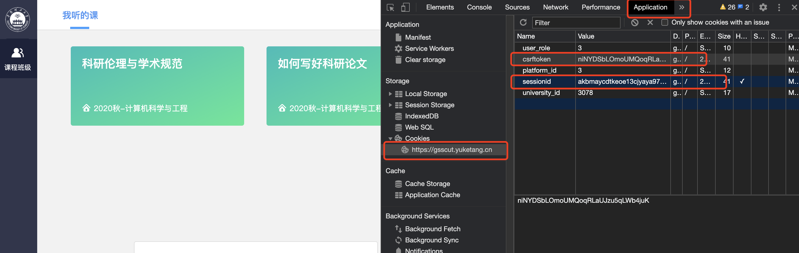

# yuketangHelper-bupt
基于 heyblackC 大佬修改 适用于 bupt yuketang 

## 须知
- 脚本假定使用者具有基本的计算机知识，懂得cookie，会按F12进入开发者模式，且会运行Python代码
- 脚本将csrftoken和sessionid更改成自己登录后的cookie中对应的字段后即可运行

## 跨校使用
1. 更改代码中学校的网站地址：university = xxx(xxx为自己学校的)
2. 根据登录后cookie里的university_id值，更改代码中university-id

